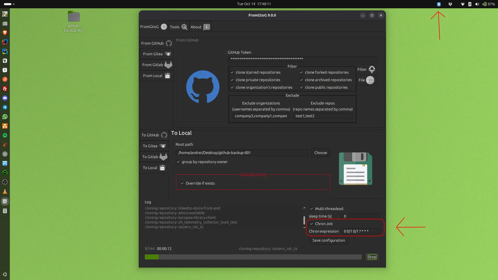

<h1 align="center"></h1>
<h1 align="right" id="title">FromGtoG v. 10.0.17</h1>

<h2 id="index">Index</h2>

- [Introduction](#introduction)
- [Features](#features)
- [User Reference Guide](./docs/fromgtog-user-reference-guide.md)

> `User Reference Guide` includes also how to generate read/write tokens on all platforms with which FromGtoG interacts.
> Most common issues are related to the token permissions.

- [Download FromGtoG 10.0.17](#download)
- [Screenshot](#screenshot)
- [Technologies](#technologies)
- [My Dev Notes about FromGtoG](#my-dev-notes)
- [Support me](#support-me)

<h2 id="introduction">Introduction</h2>

# FromGtoG 10.0.17: Advanced Git Repository Backup and Migration Utility

This application is an essential **cross-platform desktop
utility** for developers.

The **initial idea** focused only on cloning from GitHub to Gitea. Following a rapid evolution of features, FromGtoG is
now a powerful, full-fledged tool for **batch cloning** and **secure migration** between multiple platforms.

The application currently supports robust two-way cloning and backup across:

* **GitHub**
* **Gitea**
* **GitLab**
* **Local** file systems (supporting Local ↔ Remote cloning).

## Intelligent Cloning, Granular Control & Performance

FromGtoG goes beyond simple batch operations, offering advanced filtering and performance capabilities:

* **Deep Cloning**: Ensures the **complete replication** of the repository by **cloning all branches and tags**.
* **Scheduled Backup Jobs (Toggleable):** Take control of your workflow by automating complete backup and migration
  tasks using **Quartz Cron Expressions**. Users can define a schedule and **easily activate or deactivate** the job as
  needed. **If the cron job is enabled, the application will start as a daemon**; the user can open the app window by
  clicking on the **FromGtoG icon in the system tray** and hide it by clicking the close window button. To **exit
  completely**, the user must right-click on the system tray icon to access the menu and then select **Exit**. When the
  schedule matches the current time, the backup runs. During execution, the application's **system tray
  icon** flashes intermittently (red and blue) to indicate the active job, advising users not to shut down the computer
  or terminate the process.
* **Destination Repository Override:** Overrides the default skip behavior when a destination repository already exists.
  Users can now **force the update** of existing repositories. For remote destinations, this is achieved via a
  `git push --force`. For local destinations, the existing directory content is **replaced** entirely with the source
  repository's content, ensuring the destination is always an exact match of the source.
* **Detailed Logging:** Produces a comprehensive **log file** that allows you to analyze the application's work in
  detail, ensuring that every necessary repository was successfully cloned and verified.
* **Rate Limit Prevention:** Features an optional setting to define a **time interval between cloning calls** to prevent
  being banned or rate-limited by the remote server. This is especially useful for sequential (non-multi-threaded)
  operations.
* **Multi-Threading:** Utilizes **multi-threading** to **parallelize** the cloning process across multiple CPU cores,
  maximizing **speed** and **efficiency** on modern hardware.
* **Precise Repository Filtering:** Select exactly which repositories to clone based on their status or type:
    * **Private Repos**
    * **Public Repos**
    * **Organization Repos**
    * **Starred Repos**
    * **Forked Repos**
    * **Archived Repos** (Clones repositories archived on platforms like GitHub or Gitea, crucial for complete backups
      and long-term storage.)
* **Granular Control:**
    * Easily **filter out** specific repositories you do not wish to clone from the batch operation.
    * Clone **only** the repositories listed in a file, allowing developers to manage migration using an external list.

## Universal Compatibility

FromGtoG is built for maximum accessibility and stability, with dedicated support for major operating systems and
architectures:

* **Operating Systems:** **Windows**, **macOS**, and **Linux** (available as Snap and .deb package).
* **Architectures:** **amd64** (standard x86/Intel/AMD) and **arm64** (Apple Silicon/ARM Linux).

## Architectural Improvements: the evolution

To achieve the best possible structural integrity and to allow for future feature expansion, I implemented extensive use
of several **Software Design Patterns**. These patterns ensure better **modularity** and long-term stability:

* **Command Pattern:** Used for several common actions used by services.
* **Composite Pattern:** Used for robust and flexible **user input validation**, ensuring data integrity across all
  platforms.
* **Abstract Factory:** Manages flexible connections with different Git platform APIs (GitHub, Gitea, GitLab).
* **Strategy:** Enables dynamic switching of the cloning and migration logic (e.g., handling Local-to-Remote
  operations).
* **Singleton:** Ensures efficient, centralized resource management.

<h2 id="features">Feature Summary</h2>

### Cloning & Migration Matrix

The application supports robust, two-way cloning and secure migration across all supported platforms:

| Source \ Destination | GitHub | Gitea | GitLab | Local |
|:---------------------|:-------|:------|:-------|:------|
| **GitHub**           | ✅      | ✅     | ✅      | ✅     |
| **Gitea**            | ✅      | ✅     | ✅      | ✅     |
| **GitLab**           | ✅      | ✅     | ✅      | ✅     |
| **Local**            | ✅      | ✅     | ✅      | ✅     |

> **Note:** When cloning from **Local** sources to a remote destination, the utility automatically copies **only** Git
> repositories and skips other directories.

### Advanced Automation and Control

* **Scheduled Backup Jobs (Cron):** Automate complete tasks using **toggleable** **Quartz Cron Expressions**.
    * **Daemon Mode:** When cron is enabled, the application runs as a **daemon**. The window can be shown/hidden via a
      click on the **system tray icon**, and a right-click menu is used to safely **Exit** the application completely.
    * During execution, the system tray icon flashes intermittently to indicate an active job.
    * example of cron expressions:
* **Destination Repository Override:** Enables **force updates** of existing repositories (via `git push --force` for
  remote or complete content replacement for local).
* **Repository Cleanup:** Ability to delete all repositories from supported remote platforms (**GitHub**, **Gitea**, *
  *GitLab**).

### Filtering and Performance

* **Precise Filtering:** Offers granular control over batch operations by allowing selection based on status/type: *
  *Private**, **Public**, **Organization**, **Starred**, **Forked**, and **Archived** Repos.
* **Granular Control:** Easily filter out specific repositories or clone **only** those listed in an external file.
* **Multi-Threading:** Uses multi-core processing to **parallelize** cloning, maximizing **speed** and efficiency.
* **Rate Limit Prevention:** Features a customizable **waiting time** (time interval) between sequential cloning
  processes to prevent being banned by remote servers.
* **Detailed Logging:** Produces a comprehensive **log file** for detailed analysis and verification of every operation.

<h2 id="download">Download FromGtoG 10.0.17</h2>

| Platform           | AMD64 Installer                                                                                                              | ARM64 Installer                                                                                                                  | Other Installation Method(s)                                                                                                                                  |
|:-------------------|:-----------------------------------------------------------------------------------------------------------------------------|:---------------------------------------------------------------------------------------------------------------------------------|:--------------------------------------------------------------------------------------------------------------------------------------------------------------|
| **MacOS**          | [Installer ZIP](https://github.com/goto-eof/fromgtog/releases/download/10.0.17/fromgtog-MacOS-10.0.17-amd64-Installer.zip)   | [Installer ZIP](https://github.com/goto-eof/fromgtog/releases/download/10.0.17/fromgtog-MacOS-10.0.17-arm64-Installer.zip)       | N/A                                                                                                                                                           |
| **Windows**        | [Installer ZIP](https://github.com/goto-eof/fromgtog/releases/download/10.0.17/fromgtog-Windows-10.0.17-amd64-Installer.zip) | N/A                                                                                                                              | N/A                                                                                                                                                           |
| **Debian/Linux**   | [Installer ZIP](https://github.com/goto-eof/fromgtog/releases/download/10.0.17/fromgtog-Linux-10.0.17-amd64-Installer.zip)   | **Snap Store (AMD64/ARM64):** [Install Link](https://snapcraft.io/fromgtog) **Comment:** Or run `sudo snap install fromgtog`. | N/A                                                                                                                                                           |
| **Cross-Platform** | N/A                                                                                                                          | N/A                                                                                                                              | **Jar file:** [Download Link](https://github.com/goto-eof/fromgtog/releases/download/10.0.17/fromgtog.jar) **Comment:** Run with `java -jar fromgtog.jar`. |

<h2 id="screenshot">Screenshot</h2>

### FromGtoG Screenshot

### FromGtoG Screenshot - Tray Icon

<h2 id="technologies">Technologies/Tools</h2>

JDK 21, Intellij UI Designer (plugin for Intellij), Slf4J, Lombok, Apache Commons, JSON.

<h2 id="my-dev-notes">My Dev Notes about FromGtoG</h2>

- 2025/10/20 - published the version 10.0.17, which introduces the deep cloning feature (all repository branches and
  tags) and fixed some bugs.
- 2025/10/14
    - implemented the backup all repositories scheduled job and now FromGtoG has it's Tray Icon
- 2025/10/12
    - added the following GitHub Workflows in order to build executables of FromGtoG for each platform:
        - Linux (.deb)
            - amd64
            - arm64
        - MacOS (.pkg)
            - amd64
            - arm64
        - Windows (.msi)
            - amd64
            - arm64
- 2025/10/10
    - user input validation feature (composite pattern + factory pattern in order to make the code more readable) -> "
      Fianlly!" (:
    - currently validation feature is compatible only with Linux paths (not tested on other Operative Systems) -> I
      still need to complete it in order to make it cross platform
    - view tokens as password (****)
    - update log level to info -> "Fianlly!" (:
    - exclude repo names feature
    - clone only repo names stored in a file feature
- 2025/10/07
    - refactor: remove useless code - now we have auto-closable resource so it is not necessary to close them manually
    - show version number on the title bar
- 2025/10/06 - Today I applied few small improvements to the application. In particular:
    - I fixed an issue related to the Executor Service
    - I updated those parts of the code that allow to keep the total number of cloned repositories at the end of cloning
      process.
    - I fixed the "final status message". Now, if at least one git clone operation failed, FromGtoG will show a final
      error message.

      Because the improvements are not super important and because the release process on all platforms requires some
      time, I will release the new version of FromGtoG only on the Ubuntu App Center.

      About 2-3 days ago I played with Java Virtual Threads. I wanted to decrease the cloning process time. I succeeded
      to get a few seconds less than Platform Threads. Because the improvement was not significant (there is a
      bottleneck in an external library), I decided to avoid
      to include this new feature into FromGtoG application.
- 2025/06/23
    - I discovered that FromGtoG `.deb` package was not working on Debian 10. I rebuilt the package on Debian
        10. So, now it should work on both Ubuntu latest and Debian 10. I apologize for the inconvenience. Please ping
            me if
            you find a bug (
            open an issue on [GitHub](https://github.com/goto-eof/fromgtog/issues)
            or [contact me](https://andre-i.eu/#contactme)). The v. 7.0.0 should work now also on Debian 10.
            You can download it
            from [here](https://github.com/goto-eof/fromgtog/releases/download/7.0.0/fromgtog_7.0.0_amd64.deb).
    - fixed the windows/linux and macOS packaging - now it is possible to clone from GitHub. The absence of the
      `jdk.crypto.ec` and `java.security.sasl` imports in the `--add-modules` option, prevented the SSL connections,
      so the
      clone process failed, in particular for GitHub (which uses SSL).

<h2 id="support-me">Support Me</h2>

If you find this project helpful, consider [sponsoring me](https://github.com/sponsors/goto-eof) 💚

