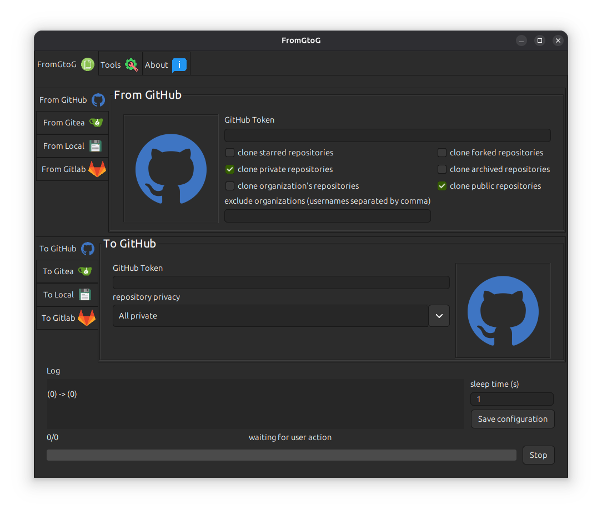

<h1 align="center"></h1>
<h1 align="right" id="title">FromGtoG v. 6.0</h1>

<h2 id="index">Index</h2>

- [Introduction](#introduction)
- [Features](#features)
- [Download](#download)
    - [MacOS](#download-macos)
    - [Windows](#download-windows)
    - [Linux](#download-linux)
- [Technologies/Tools](#technologies)
- [Screenshot](#screenshot)

<h2 id="introduction">Introduction</h2>

A few days ago, I published FromGtoG 3.0 on the [Ubuntu Snap Store](https://snapcraft.io/fromgtog).
Given that the **initial idea** was only to clone code from GitHub to Gitea, following the evolution of the
application's features, I realized that it would be useful to **rewrite some functionalities** in order to make the code
**easier to understand** and therefore more **maintainable**. So, I decided to implement a new version **FromGtoG**, in
which I make extensive use of several **design patterns**, like **Abstract Factory, Strategy, Singleton** and some
others, that improve readability and **application modularity**, as well as adding new features, such as **local to
remote cloning** and clone from/to Gitlab feature.

<h2 id="features">Features</h2>

Currently, the application is able to clone:

- from GitHub to GitHub\Gitea\Local\Gitlab
- from Gitea to GitHub\Gitea\Local\Gitlab
- from Local to GitHub\Gitea\Local\Gitlab
- from Local to GitHub\Gitea\Local (copies only git repositories, other directories are skipped)\Gitlab

Further features (in the tools section)

- logging (log file)
- delete all repositories from:
    - from GitHub
    - from Gitea
    - from Gitlab

<h2 id="download">Download</h2>

- <h2 id="download-macos">MacOS</h2>

  [Download MacOS installer](https://github.com/goto-eof/fromgtog/releases/download/6.0.13/FromGtoG-6.0.13.pkg) - just
  install the .pkg file

- <h2 id="download-windows">Windows</h2>

  [Download Windows installer](https://github.com/goto-eof/fromgtog/releases/download/6.0.13/FromGtoG-6.0.13.msi) - just
  install the .msi file and start cloning

- <h2 id="download-linux">Linux</h2>

  [Download Ubuntu .deb package](https://github.com/goto-eof/fromgtog/releases/download/6.0.13/fromgtog_6.0.13_amd64.deb) -
  in order to install the .deb package execute `sudo dpkg -i romgtog_6.0.13_amd64.deb`

  [Install from Ubutnu Snapstore](https://snapcraft.io/fromgtog) - execute `sudo snap install fromgtog` in order to
  install the application.

<h2 id="technologies">Technologies/Tools</h2>

JDK 21, Intellij UI Designer (plugin for Intellij), Slf4J, Lombok, Apache Commons, JSON.

<h2 id="screenshot">Screenshot</h2>




## Retrieve dependency modules of the jar

```bash
jdeps -s fromgtog.jar
```

## Generate a standalone for MacOS

```bash
jpackage --type pkg --name "FromGtoG" --vendor "Andrei Dodu" --app-version "6.0.13" --input "target" --main-jar "fromgtog.jar" --main-class "com.andreidodu.fromgtog.Main" --dest "executable" --add-modules java.base,java.desktop,java.net.http,java.naming,java.sql --verbose
```

## Generate a standalone for Windows

```bash
jpackage -t msi --name "FromGtoG" --vendor "Andrei Dodu" --app-version 6.0.13 --input "target" --dest "executable" --main-jar "fromgtog.jar" --icon "resources\icon.ico" --resource-dir resources --add-modules java.base,java.desktop,java.net.http,java.naming,java.sql --win-shortcut --win-menu --main-class com.andreidodu.fromgtog.Main
```

## Generate a standalone for Linux

```bash
jpackage --type deb --name "FromGtoG" --vendor "Andrei Dodu" --app-version "6.0.13" --input "target" --main-jar "fromgtog.jar" --main-class "com.andreidodu.fromgtog.Main" --dest "executable" --add-modules java.base,java.desktop,java.net.http,java.naming,java.sql --linux-shortcut --verbose
```
