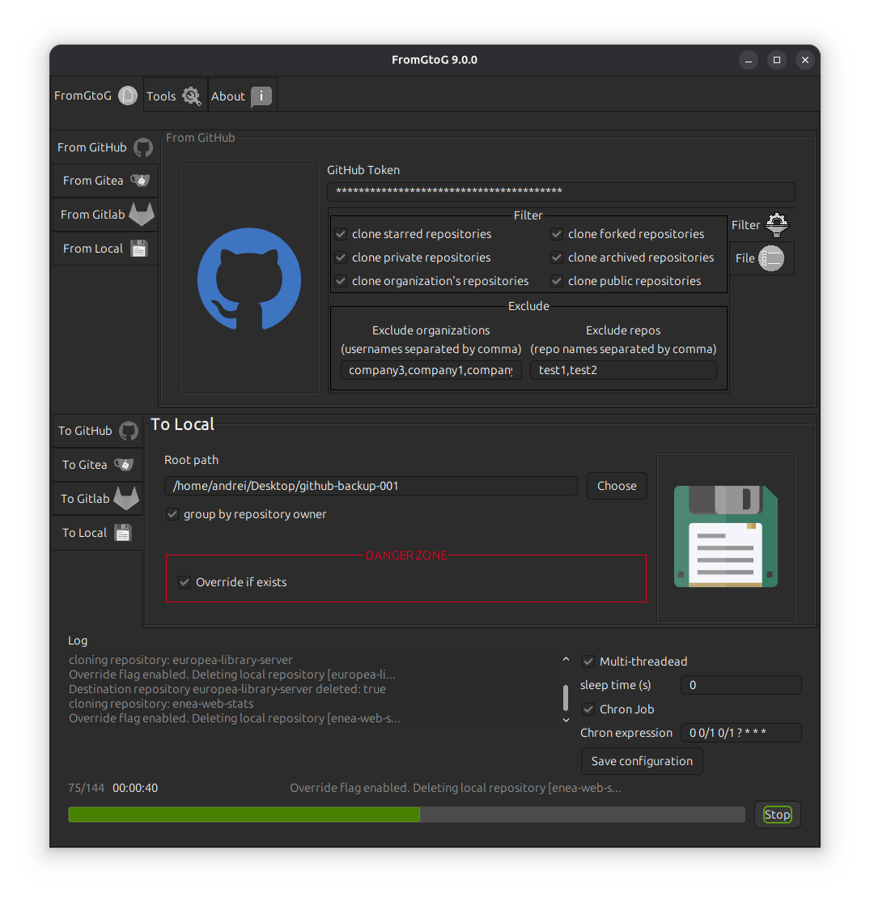

<h1 align="center"></h1>
<h1 align="right" id="title">FromGtoG v. 8.0.0</h1>

<h2 id="index">Index</h2>

- [Introduction](#introduction)
- [News](#news)
- [Features](#features)
- [Download (Stable)](#download)
    - [MacOS](#download-macos)
    - [Windows](#download-windows)
    - [Linux](#download-linux)
- [Screenshot](#screenshot)
- [For developers](#for-developers)
- [Tested on](#tested-on)
- [Support me](#support-me)

<h2 id="introduction">Introduction</h2>

A few days ago, I published FromGtoG 3.0 on the [Ubuntu Snap Store](https://snapcraft.io/fromgtog).
Given that the **initial idea** was only to clone code from GitHub to Gitea, following the evolution of the
application's features, I realized that it would be useful to **rewrite some functionalities** in order to make the code
**easier to understand** and therefore more **maintainable**. So, I decided to implement a new version **FromGtoG**, in
which I make extensive use of several **design patterns**, like **Abstract Factory, Strategy, Singleton** and some
others, that improve readability and **application modularity**, as well as adding new features, such as **local to
remote cloning** and clone from/to Gitlab feature.

<h2 id="news">News</h2>

- 2025/10/10
    - user input validation feature (composite pattern + factory pattern in order to make the code more readable) -> "Fianlly!" (:
    - currently validation feature is compatible only with Linux paths (not tested on other Operative Systems) -> I still need to complete it in order to make it cross platform
    - view tokens as password (****)
    - update log level to info -> "Fianlly!" (:
- 2025/10/07
    - refactor: remove useless code - now we have auto-closable resource so it is not necessary to close them manually
    - show version number on the title bar
- 2025/10/06 - Today I applied few small improvements to the application. In particular:
    - I fixed an issue related to the Executor Service
    - I updated those parts of the code that allow to keep the total number of cloned repositories at the end of cloning
      process.
    - I fixed the "final status message". Now, if at least one git clone operation failed, FromGtoG will show a final
      error message.

      Because the improvements are not super important and because the release process on all platforms requires some
      time, I will release the new version of FromGtoG only on the Ubuntu App Center.

      About 2-3 days ago I played with Java Virtual Threads. I wanted to decrease the cloning process time. I succeeded
      to get a few seconds less than Platform Threads. Because the improvement was not significant (there is a
      bottleneck in an external library), I decided to avoid
      to include this new feature into FromGtoG application.
- 2025/06/23 - I discovered that FromGtoG `.deb` package was not working on Debian 10. I rebuilt the package on Debian
    10. So, now it should work on both Ubuntu latest and Debian 10. I apologize for the inconvenience. Please ping me if
        you find a bug (
        open an issue on [GitHub](https://github.com/goto-eof/fromgtog/issues)
        or [contact me](https://andre-i.eu/#contactme)). The v. 7.0.0 should work now also on Debian 10.
        You can download it
        from [here](https://github.com/goto-eof/fromgtog/releases/download/7.0.0/fromgtog_7.0.0_amd64.deb).
- fixed the windows/linux and macOS packaging - now it is possible to clone from GitHub. The absence of the
  `jdk.crypto.ec` and `java.security.sasl` imports in the `--add-modules` option, prevented the SSL connections, so the
  clone process failed, in particular for GitHub (which uses SSL).

<h2 id="features">Features</h2>

Currently, the application is able to clone:

- from GitHub to GitHub\Gitea\Local\Gitlab
- from Gitea to GitHub\Gitea\Local\Gitlab
- from Gitlab to GitHub\Gitea\Local\Gitlab
- from Local to GitHub\Gitea\Local (copies only git repositories, other directories are skipped)\Gitlab

Further features

- multi-threading
- logging (log file)
- delete all repositories from:
    - from GitHub
    - from Gitea
    - from Gitlab

<h2 id="download">Download (Stable)</h2>

- <h2 id="download-macos">MacOS</h2>

  [Download MacOS installer](https://github.com/goto-eof/fromgtog/releases/download/7.0.0/FromGtoG-7.0.0.pkg)- just
  install the .pkg file. Note: for copy/paste actions, please use `Control + C` and `Control + V` (I will enable
  `Command + C` and `Command + V` in the future.)

- <h2 id="download-windows">Windows</h2>

  [Download Windows installer](https://github.com/goto-eof/fromgtog/releases/download/7.0.0/FromGtoG-7.0.0.exe)- just
  install the .exe file and start cloning.

- <h2 id="download-linux">Linux</h2>

  [Download Ubuntu .deb package](https://github.com/goto-eof/fromgtog/releases/download/7.0.0/fromgtog_7.0.0_amd64.deb) -
  in order to install the .deb package execute `sudo dpkg -i romgtog_7.0.0_amd64.deb`

  [Install from Ubutnu Snapstore](https://snapcraft.io/fromgtog) - or execute `sudo snap install fromgtog` in order to
  install the application.

<h2 id="technologies">Technologies/Tools</h2>

JDK 21, Intellij UI Designer (plugin for Intellij), Slf4J, Lombok, Apache Commons, JSON.

<h2 id="screenshot">Screenshot</h2>




<h2 id="for-developers">For developers</h2>

## Retrieve dependency modules of the jar

```bash
jdeps -s fromgtog.jar
```

## Generate a standalone for MacOS

It is necessary to install Xcode Command Line Tools before.

```bash
jpackage --type pkg --name "FromGtoG" --vendor "Andrei Dodu" --app-version "8.0.0" --input "target" --main-jar "fromgtog.jar" --icon "resources/icon.icns" --main-class "com.andreidodu.fromgtog.Main" --dest "executable" --add-modules java.base,java.desktop,java.net.http,jdk.crypto.ec,java.security.sasl,java.naming,java.sql,java.management,java.security.jgss,java.xml,java.logging --verbose --java-options "-Dawt.useSystemAAFontSettings=on -Dswing.aatext=true -Dsun.java2d.uiScale=true"
```

## Generate a standalone for Windows

It is necessary to install Wix Toolset before.

```bash
jpackage -t exe --name "FromGtoG" --vendor "Andrei Dodu" --app-version "8.0.0" --input "target" --dest "executable" --main-jar "fromgtog.jar" --icon "resources\icon.ico" --resource-dir resources --add-modules java.base,java.desktop,java.net.http,java.naming,java.sql,java.management,java.security.jgss,java.xml,java.logging,jdk.crypto.ec,java.security.sasl --win-shortcut --win-menu --main-class com.andreidodu.fromgtog.Main
```

## Generate a standalone for Linux

```bash
jpackage --type deb --name "FromGtoG" --vendor "Andrei Dodu" --app-version "8.0.0" --input "target" --main-jar "fromgtog.jar" --icon "resources/icon.png" --main-class "com.andreidodu.fromgtog.Main" --dest "executable" --add-modules java.base,java.desktop,java.net.http,java.naming,java.sql,java.management,java.security.jgss,java.xml,java.logging,jdk.crypto.ec,java.security.sasl --linux-shortcut --verbose --linux-package-deps "libasound2, libpulse0"
```

## Usefully commands

```bash
jar tvf fromgtog.jar 
```

### Generate and upload snap file - useful especially for me (:

```bash
sudo snap remove fromgtog && snapcraft clean && snapcraft && sudo snap install fromgtog_8.0.0_amd64.snap --dangerous && fromgtog

snapcraft upload --release=edge fromgtog_8.0.0_amd64.snap
```

<h2 id="tested-on">Tested on</h2>

- Ubuntu 25.04
- Debian 10
- Windows 11
- MacOS

<h2 id="support-me">Support Me</h2>

If you find this project helpful, consider [sponsoring me](https://github.com/sponsors/goto-eof) 💚

[](https://github.com/sponsors/goto-eof)


