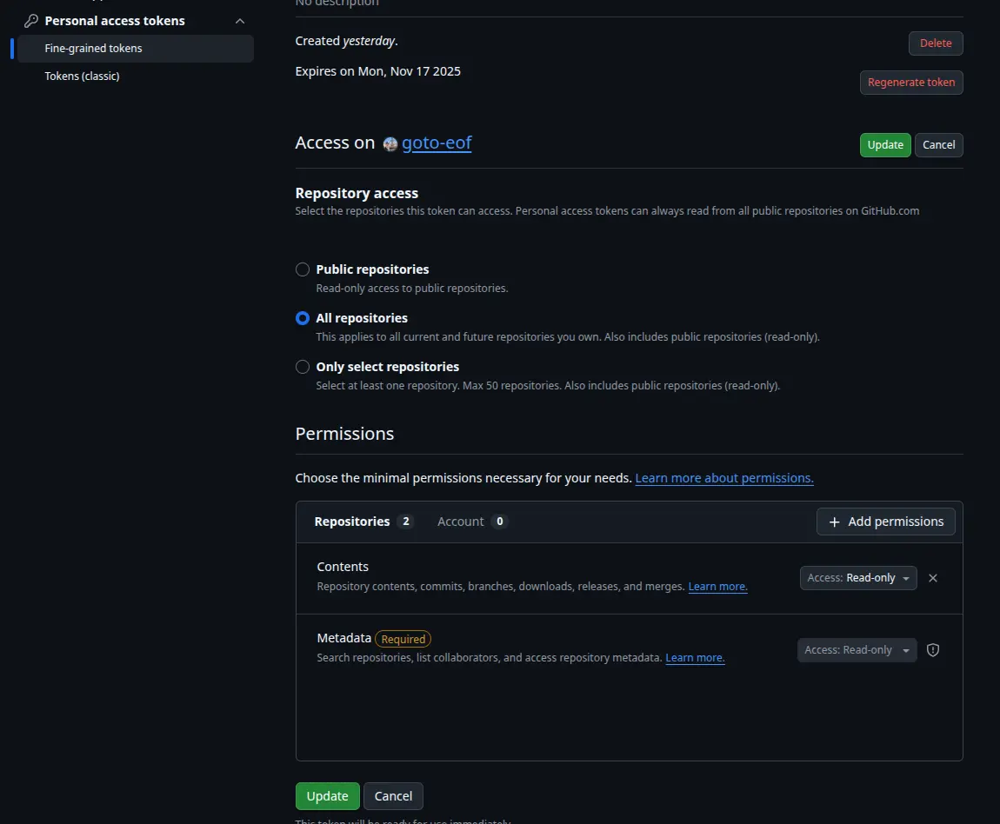

<h2 align="center">FromGtoG</h2>
<h1  id="index" align="center">User Reference Guide (v10.0+)</h1>
<div align='right'>Document revision version: 1.0</div>
<div align='right'>Last update: 19/10/2025</div>
<div align='right'>Author: Andrei Dodu</div>

## Index

- [Document Revision History](#document-revision-history)
- [Aim of this Document](#document-aim)
- [Application Description](#description)


- [Installation](#installation)

> The user must carefully configure the permissions for their token; otherwise, the application will not function
> correctly.

- [Generating a GitHub Token](#token-generation-github)
- [Generating a Gitea Token](#token-generation-gitea)
- [Generating a Gitlab Token](#token-generation-gitlab)

- [From GitHub Section](#from-github-section)
    - From GitHub - Filter Tab
    - From GitHub - File Tab
- [From Gitea Section](#from-gitea-section)
    - From Gitea - Filter Tab
    - From Gitea - File Tab
- [From Gitlab Section](#from-gitlab-section)
    - From Gitlab - Filter Tab
    - From Gitlab - File Tab
- [From Local Section](#from-local-section)
- [To GitHub Section](#to-github-section)
- [To Gitea Section](#to-gitea-section)
- [To Gitlab Section](#to-gitlab-section)
- [To Local Section](#to-local-section)
- [Application Settings](#settings)
- [Application Tools](#tools)

---


<h1 id="document-revision-history">Document Revision History</h1>

| revision | date       | description                         |
|:---------|:-----------|:------------------------------------|
| 1.0      | 18/10/2025 | Valid for FromGtoG version 10.0.0+. |

[Go to Top](#index)


<h1 id="document-aim">Aim of this Document</h1>

This document is a technical guide to help users optimally configure and utilize the consolidated **FromGtoG** GUI
application for cloning repositories between various Git hosts (GitHub, GitLab, Bitbucket) and local filesystems.

[Go to Top](#index)


<h1 id="description">Application Description</h1>

**FromGtoG** is an **essential** **cross-platform desktop utility** for developers focused on *
*Advanced Git Repository Backup and Migration**.

This application allows users to execute **batch cloning** and **secure migration** operations across all major Git
hosting platforms, including **GitHub**, **Gitea**, and **GitLab**, as well as local file systems. It distinguishes
itself by offering powerful features like **deep cloning** (ensuring all branches and tags are backed up), **scheduled
automation** (using a configurable job to make auto backups), high-speed **multi-threading** for efficiency, and *
*granular control** over repository filtering and cloning rules, ensuring you always maintain a complete and reliable
backup workflow.

[Go to Top](#index)


<h1 id="installation">Installation</h1>

## Windows / MacOS

If you use Windows or macOS, just download the installer and provide the permission to execute the file even if it is
from unknown source.

| Platform           | AMD64 Installer                                                                                                            | ARM64 Installer                                                                                                                  | Other Installation Method(s)                                                                                                                                 |
|:-------------------|:---------------------------------------------------------------------------------------------------------------------------|:---------------------------------------------------------------------------------------------------------------------------------|:-------------------------------------------------------------------------------------------------------------------------------------------------------------|
| **MacOS**          | [Installer ZIP](https://github.com/goto-eof/fromgtog/releases/download/10.0.0/fromgtog-MacOS-10.0.0-amd64-Installer.zip)   | [Installer ZIP](https://github.com/goto-eof/fromgtog/releases/download/10.0.0/fromgtog-MacOS-10.0.0-arm64-Installer.zip)         | N/A                                                                                                                                                          |
| **Windows**        | [Installer ZIP](https://github.com/goto-eof/fromgtog/releases/download/10.0.0/fromgtog-Windows-10.0.0-amd64-Installer.zip) | N/A                                                                                                                              | N/A                                                                                                                                                          |
| **Debian/Linux**   | [Installer ZIP](https://github.com/goto-eof/fromgtog/releases/download/10.0.0/fromgtog-Linux-10.0.0-amd64-Installer.zip)   | **Snap Store (AMD64/ARM64):** [Install Link](https://snapcraft.io/fromgtog)<br>**Comment:** Or run `sudo snap install fromgtog`. | N/A                                                                                                                                                          |
| **Cross-Platform** | N/A                                                                                                                        | N/A                                                                                                                              | **Jar file:** [Download Link](https://github.com/goto-eof/fromgtog/releases/download/10.0.0/fromgtog.jar)<br>**Comment:** Run with `java -jar fromgtog.jar`. |

## Linux

Download
the [zip](https://github.com/goto-eof/fromgtog/releases/download/10.0.0/fromgtog-Linux-10.0.0-amd64-Installer.zip) file
and execute:

```bash
sudo dpkg -i PACKAGE_NAME
```

or

```bash
sudo snap install fromgtog
```

in order to install the application from the Snap Store.

## Other platforms

Download the [.jar](https://github.com/goto-eof/fromgtog/releases/download/10.0.0/fromgtog.jar) file and install JRE 21.
Then from the terminal run:

```bash
java -jar JAR_NAME
```

```bash
npm install -g fromgtog
```

[Go to Top](#index)


<h1 id="token-generation-github">Generating a GitHub Token</h1>

- log in to GitHub as the user that will own the token
- go to *Settings* → *Developer Settings* → *Fine-grained tokens* → *Generate new token*
- in the *Repository access* section select *All repositories*
- in the *Permissions* section, click on the *Add permission* button
    - Read Only Token - if the token is for the **source** platform
        - add the *Contents* permission
            - set it to `read`
        - add the **Metadata** permission
            - set it to `read`
    - Read and Write Token - if the token is for the **destination** platform
        - add the *Contents* permission
            - set it to `read and write` if the token is for the destination platform
        - add the *Metadata* permission if not present
            - set it to `read`
        - add the **Administration** permission
            - set it to `read and write`
        - add the **Workflows** permission
            - set it to `read and write`
- click on *Update* button
    - copy the new generated token and copy the token immediately — you won’t be able to see it again

> Note:
> the UI paths and labels may vary slightly

| Screenshot                                                                                 |
|--------------------------------------------------------------------------------------------|
|  |

[Go to Top](#index)


<h1 id="token-generation-gitea">Generating a Gitea Token</h1>

- log in to Gitea as the user that will own the token
- click your *avatar* → *Settings* → *Applications* (*Manage Access Tokens / Applications*)
- in Manage Access Tokens click *Generate New Token*
- give it a name
- select *All (public, private, and limited)*
- select read scopes only:
    - Read Only Token - if the token is for the **source** platform
        - *user* → read (allows to read user profile info necessary for FromGtoG)
        - *repo* → read
    - Read and Write Token - if the token is for the **destination** platform
        - *user* → read (allows to read user profile info necessary for FromGtoG)
        - *repo* → read and write → if is the destination platform
- click *Generate Token* and copy the token immediately — you won’t be able to see it again

> Note:
> the UI paths and labels may vary slightly between Gitea versions.

| Screenshot                                                                               |
|------------------------------------------------------------------------------------------|
|  |

[Go to Top](#index)


<h1 id="token-generation-gitlab">Generating a Gitlab Token</h1>

How to create a read-only PAT

- log in to GitLab as the user who owns the token
- click your avatar → *Edit Profile* → *Access Tokens*
- click on *Add new token*
- give the token:
    - *name* → e.g., read-only-token
    - *expiry date* → optional but recommended
    - *scopes* → select only the minimum needed:
        - Read Only Token - if the token is for the **source** platform
            - *read_api* → list projects the user has access to (personal + group projects)
              platform
            - *read_repository*
        - Read and Write Token - if the token is for the **destination** platform
            - *api* → in order to update the repository privacy
            - *read_api* → list projects the user has access to (personal + group projects)
            - *read_repository*
            - *write_repository*
- click *Create personal access token* and copy the token immediately — you won’t be able to see it again

> Note:
> the UI paths and labels may vary slightly between Gitea versions.

| Screenshot                                                                                 |
|--------------------------------------------------------------------------------------------|
|  |

[Go to Top](#index)


<h1 id="from-github">From GitHub Section</h1>

<h2 id="from-github-filter">From GitHub - Filter Tab</h2>


In the Filter tab we can apply a filter for the repository cloning process.

**GitHub Token** - insert your read only GitHub token

**Clone starred repositories** - allows to clone those repositories that the GitHub user liked

**Clone forked repositories** - allows to clone those repositories that the GitHub user forked

**Clone private repositories** - allows to clone those repositories that the GitHub user made private

**Clone archived repositories** - allows to clone those repositories that the GitHub user archived

**Clone organization's repositories** - allows to clone those repositories belonging to the organization to which the
user belongs

**Clone public repositories** - allows to clone those repositories that the GitHub user made public

**Exclude Organizations (usernames separated by comma)** - In order to exclude the repositories of specific
usernames it is necessary to specify the exclude username list, like:
`usernameA,organizationA,usernameb,organizationCUsername`

**Exclude repos (repos separated by comma)** - In order to exclude some repositories it is necessary to specify the
exclude username list, like:
`repo-1,myrepo2,myrepo-3`

<h2 id="from-github-file">From GitHub - File Tab</h2>


In the File tab we can define the list of repositories that should be cloned.

**GitHub Token** - insert your read only GitHub token

**File containing the repo list names to clone (file line pattern: repo-name + new line)** - allows to select the file
that contains all repositories that the application should clone. The file pattern is "each line contains a valid
repository name".

[Go to Top](#index)


<h1 id="application-from-gitea-section">From Gitea Section</h1>

<h2 id="from-gitea-filter">From Gitea - Filter Tab</h2>


**Gitea URL** - the base URL with port number of Gitea repository (like: http://192.168.1.123:1000)

**Gitea Token** - insert your read only Gitea token

**Clone starred repositories** - allows to clone those repositories that the Gitea user liked

**Clone forked repositories** - allows to clone those repositories that the Gitea user forked

**Clone private repositories** - allows to clone those repositories that the Gitea user made private

**Clone archived repositories** - allows to clone those repositories that the Gitea user archived

**Clone organization's repositories** - allows to clone those repositories belonging to the organization to which the
user belongs

**Clone public repositories** - allows to clone those repositories that the Gitea user made public

**Exclude Organizations (usernames separated by comma)** - In order to exclude the repositories of specific
usernames it is necessary to specify the exclude username list, like:
`usernameA,organizationA,usernameb,organizationCUsername`

**Exclude repos (repos separated by comma)** - In order to exclude some repositories it is necessary to specify the
exclude username list, like:
`repo-1,myrepo2,myrepo-3`

<h2 id="from-gitea-file">From Gitea - File Tab</h2>


In the File tab we can define the list of repositories that should be cloned.

**Gitea URL** - the base URL with port number of Gitea repository (like: http://192.168.1.123:1000)

**Gitea Token** - insert your read only Gitea token

**File containing the repo list names to clone (file line pattern: repo-name + new line)** - allows to select the file
that contains all repositories that the application should clone. The file pattern is "each line contains a valid
repository name".

[Go to Top](#index)


<h1 id="application-from-gitlab-section">From Gitlab Section</h1>

<h2 id="from-gitlab-filter">From Gitlab - Filter Tab</h2>


**Gitlab URL** - the base URL with port number of Gitea repository (like: http://192.168.1.123:1000)

**Gitlab Token** - insert your read only Gitlab token

**Clone starred repositories** - allows to clone those repositories that the Gitlab user liked

**Clone forked repositories** - allows to clone those repositories that the Gitlab user forked

**Clone private repositories** - allows to clone those repositories that the Gitlab user made private

**Clone archived repositories** - allows to clone those repositories that the Gitlab user archived

**Clone organization's repositories** - allows to clone those repositories belonging to the organization to which the
user belongs

**Clone public repositories** - allows to clone those repositories that the Gitlab user made public

**Exclude Organizations (usernames separated by comma)** - In order to exclude the repositories of specific
usernames it is necessary to specify the exclude username list, like:
`usernameA,organizationA,usernameb,organizationCUsername`

**Exclude repos (repos separated by comma)** - In order to exclude some repositories it is necessary to specify the
exclude username list, like:
`repo-1,myrepo2,myrepo-3`

<h2 id="from-gitlab-file">From Gitlab - File Tab</h2>


In the File tab we can define the list of repositories that should be cloned.

**Gitlab URL** - the base URL with port number of Gitlab repository (like: http://192.168.1.123:1000)

**Gitlab Token** - insert your read only Gitlab token

**File containing the repo list names to clone (file line pattern: repo-name + new line)** - allows to select the file
that contains all repositories that the application should clone. The file pattern is "each line contains a valid
repository name".

[Go to Top](#index)


<h1 id="from-local-section">From Local Section</h1>


**root path** - allows to specify the path from where the application should take the repositories to clone.

[Go to Top](#index)


<h1 id="fromgtog-from-gitea-to-github-section">To GitHub Section</h1>


**GitHub Token** - insert your read and write GitHub token

**repository privacy** - allows to override the visibility of the repository:

- like source repository - if the original repository is private, then also the cloned repo will be private, otherwise
  public
- all private - even if a repository is public, the cloned repository will be private
- all public - even if a repository is private, the cloned repository will be public

**override destination if exists** - as described, If a repository with the same name is found during the cloning
process, it will be overwritten by the GitHub one.

[Go to Top](#index)


<h1 id="to-gitea-section">To Gitea Section</h1>


**Gitlab URL** - the base URL with port number of Gitea repository (like: http://192.168.1.123:1000)

**Gitea Token** - insert your read and write Gitea token

**repository privacy** - allows to override the visibility of the repository:

- like source repository - if the original repository is private, then also the cloned repo will be private, otherwise
  public
- all private - even if a repository is public, the cloned repository will be private
- all public - even if a repository is private, the cloned repository will be public

**override destination if exists** - as described, If a repository with the same name is found during the cloning
process, it will be overwritten by the Gitea one.

[Go to Top](#index)


<h1 id="to-gitlab-section">To Gitlab Section</h1>


**Gitlab URL** - the base URL with port number of Gitlab repository (like: http://192.168.1.123:1000)

**Gitlab Token** - insert your read and write Gitlab token

**repository privacy** - allows to override the visibility of the repository:

- like source repository - if the original repository is private, then also the cloned repo will be private, otherwise
  public
- all private - even if a repository is public, the cloned repository will be private
- all public - even if a repository is private, the cloned repository will be public

**override destination if exists** - as described, If a repository with the same name is found during the cloning
process, it will be overwritten by the Gitlab one.

[Go to Top](#index)


<h1 id="to-local-section">To Local Section</h1>


**local directory path** - allows to specify the path where the repositories will be cloned.

**group by repository owner** - allows to group repositories by repo owners, which means that for each repository owner
will be created a directory that will contain the cloned repository.

**override destination if exists** - as described, If a repository with the same name is found during the cloning
process, it will be overwritten by the Local one.

[Go to Top](#index)


<h1 id="settings">Application Settings</h1>


**Multithreaded** - allows to execute the cloning process in parallel

**Sleep (seconds)** - sleep time between clone operations (useful if single-threaded and the source platform bans the ip
if too many connections are established)

**Save the current configuration (valid for all tabs)** - creates a snapshot of the current configuration, including
tokens and enabled options.

**cron-job** - allows to execute automatic backup operations in base of the time defined by the cron expression

**Cron expression** - allows to define when it is necessary to start the job

###### Example of cron expressions

| cron expression                  | descritpion              |
|:---------------------------------|:-------------------------|
| 0 0 * ? * * *                    | every hour               |
| 0 0 0/1 ? * * *                  | every day                |
| 0 0 15 ? * * *                   | every day at 3 PM        |
| 0 0 15 ? * MON,TUE,WED,THU,FRI * | from Mo. to Fri. at 3 PM |

> You can generate your custom cron expression [here](https://freeformatter.com/cron-expression-generator-quartz.html).

**Start** - starts the cloning operation or the job

**Stop** - stops the cloning operation or the job

[Go to Top](#index)


<h1 id="tools">Tools</h1>


**clear log file** - clear the log file

**View log file** - allows to open the log file for more in-depth analysis of the cloning process

**Delete ALL GitHub Repositories** - allows to DELETE ALL the repositories on GitHub
**Delete ALL Gitea Repositories** - allows to DELETE ALL the repositories on Gitea
**Delete ALL Gitlab Repositories** - allows to DELETE ALL the repositories on Gitlab

[Go to Top](#index)